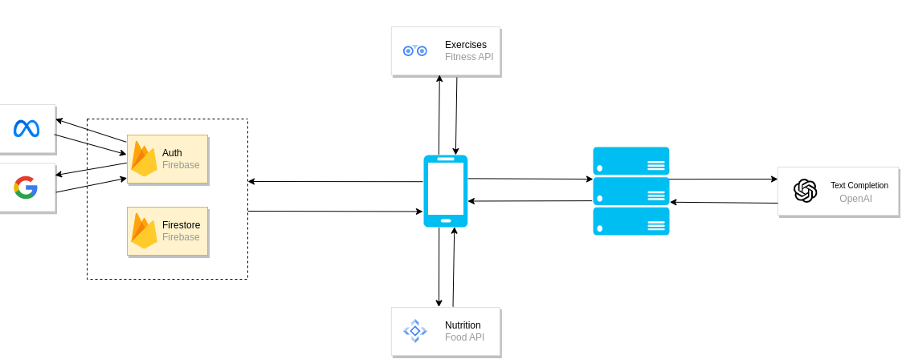

# Fitness app

## Description

Application for workout plan preparing, composing diet etc.

## Table of contents

- [Modules](#modules)
- [Techstack](#techstack)
- [APIs](#apis)
- [Architecture](#architecture)

## Modules

- [React Native Client](./react-native-fit-health-ui/)
- [Node Server](./node-fit-health-api/)

## Techstack

- `React Native`
- `Node.js`
- `Firebase`

## APIs

- [Nutrition API](https://www.edamam.com/)
- [Exercise API](https://rapidapi.com/mortimerbrian135/api/exerciseapi3)
- [OpenAI API](https://platform.openai.com/docs/guides/completion)

## Architecture

Application use REST architecture style.

Client use `Firebase` which allows user to auth with credentials and 3 party providers, such as `Google` and `Meta`.

Client communicate with `Nutrition` and `Exercise` API's in order to create diet plans, calculate nutrition, create training plans etc.

Server communicate with `OpenAI` API in order to use ChatBot functionality.

arch

